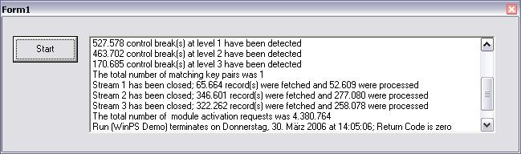

## Batch Program Controller

### Description

This is a 'Finite State Machine' Class to control batch type sequential client programs which fetch records from one or more sequential (normally keyed) data streams and optionally merge them into one stream, and/or exchanges data between matching records. This is done by invoking the discrete procedural steps in a logical sequence (eg FetchNextRecord, GroupHeader, ProcessRecord, GroupFooter etc) which the client program is arranged into. Also supported and invoked are control breaks for outputting subtotals, totals or grand totals; the control breaks are further subdivided into group header and group footer. The class supports a great variety of properties which may come in handy during program execution.

Examples for this kind of programs are manifold: Invoicing, batch account-updating from transactions, grouped statistics, budgets and ballances, or report writers with subtotals and totals to name just a few.

A comprehensive documentation is included.

Compile WinPS 1st, register it if necessary using RegSvr32, and then add a reference to it to TestNewPS (or to any other project that might be using it).

Download is 85 kB.
 
### More Info
 

             |
---                |---
**Submitted On**   |2006-03-30 15:39:02
**By**             |[ULLI](https://github.com/Planet-Source-Code/PSCIndex/blob/master/ByAuthor/ulli.md)
**Level**          |Advanced
**User Rating**    |5.0 (15 globes from 3 users)
**Compatibility**  |VB 6\.0
**Category**       |[Libraries](https://github.com/Planet-Source-Code/PSCIndex/blob/master/ByCategory/libraries__1-49.md)
**World**          |[Visual Basic](https://github.com/Planet-Source-Code/PSCIndex/blob/master/ByWorld/visual-basic.md)
**Archive File**   |[Batch\_Prog198517442006\.zip](https://github.com/Planet-Source-Code/ulli-batch-program-controller__1-64919/archive/master.zip)

